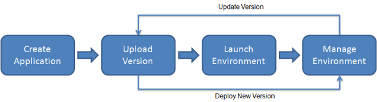

#### GitFlow
GitFlow je jedan od modela grananja za version control koji omogucuje kreiranje vise nivoa grananja. Nivoi grana koji su moguci se nazivaju `feature` koji se stvaraju periodicno, te kada zavrsimo za izmjenama na kodu, `feature` grana se brise
- Master grana sadrzi produkcijski kod 
- Development grana sadrzi bazu za sve dijelove aplikacije koji ce ici na master granu 
- Feature (short-lived) grane sadrze izmjene koje svaki od programera radi i kada se zavrsi dodatak aplikacije na kojem se radi, ovaj feature se brise
#### Cloud9
Cloud9 je Workspace ili IDE od strane AWS-a koji nam dozvoljava da pisemo, pokrecemo i radimo debug na nasem kodu. 
- Kreiramo `enviroment` unutar Cloud9 
- Za potrebe ovog workshop-a, potrebno je da uvecamo Amazon EBS volume.
```bash
touch resize.sh # kreiranje shell skripte koja ce uvecati image
```

```bash
#!/bin/bash

# Specify the desired volume size in GiB as a command line argument. If not specified, default to 20 GiB.
SIZE=${1:-20}

# Get the ID of the environment host Amazon EC2 instance.
INSTANCEID=$(curl http://169.254.169.254/latest/meta-data/instance-id)
REGION=$(curl -s http://169.254.169.254/latest/meta-data/placement/availability-zone | sed 's/\(.*\)[a-z]/\1/')

# Get the ID of the Amazon EBS volume associated with the instance.
VOLUMEID=$(aws ec2 describe-instances \
  --instance-id $INSTANCEID \
  --query "Reservations[0].Instances[0].BlockDeviceMappings[0].Ebs.VolumeId" \
  --output text \
  --region $REGION)

# Resize the EBS volume.
aws ec2 modify-volume --volume-id $VOLUMEID --size $SIZE

# Wait for the resize to finish.
while [ \
  "$(aws ec2 describe-volumes-modifications \
    --volume-id $VOLUMEID \
    --filters Name=modification-state,Values="optimizing","completed" \
    --query "length(VolumesModifications)"\
    --output text)" != "1" ]; do
sleep 1
done

#Check if we're on an NVMe filesystem
if [[ -e "/dev/xvda" && $(readlink -f /dev/xvda) = "/dev/xvda" ]]
then
  # Rewrite the partition table so that the partition takes up all the space that it can.
  sudo growpart /dev/xvda 1

  # Expand the size of the file system.
  # Check if we're on AL2
  STR=$(cat /etc/os-release)
  SUB="VERSION_ID=\"2\""
  if [[ "$STR" == *"$SUB"* ]]
  then
    sudo xfs_growfs -d /
  else
    sudo resize2fs /dev/xvda1
  fi

else
  # Rewrite the partition table so that the partition takes up all the space that it can.
  sudo growpart /dev/nvme0n1 1

  # Expand the size of the file system.
  # Check if we're on AL2
  STR=$(cat /etc/os-release)
  SUB="VERSION_ID=\"2\""
  if [[ "$STR" == *"$SUB"* ]]
  then
    sudo xfs_growfs -d /
  else
    sudo resize2fs /dev/nvme0n1p1
  fi
fi
```
- Iznad je prikazana skripta ciji je zadatak da uveca prostor diska

```bash
bash resize.sh 30 # parametar koji skripta prima za koliko ce povecati image
```

```bash
df -h # komanda za provjeru stanja filesystem-a
```

#### Git config
- Iduci koraci predstavljaju konfiguraciju git-a unutar cloud9
``` bash
git config --global user.name "Full Name"
```

```bash 
git config --global user.email email@amazon.com
```

```bash 
# komande za konfiguraciju AWS CLI credential helper za HTTPS konekcije
git config --global credential.helper '!aws codecommit credential-helper $@'
git config --global credential.UseHttpPath true
```

#### Instalacija gitflow
```bash 
curl -OL https://raw.github.com/nvie/gitflow/develop/contrib/gitflow-installer.sh
chmod +x gitflow-installer.sh
sudo git config --global url."https://github.com".insteadOf git://github.com
sudo ./gitflow-installer.sh
```

#### AWS Cloudformation



- Na slici je prikazana arhitektura koju cemo kreirati koristeci Elastic Beanstalk servis.
- Elastic Beanstalk je servis koji nam olaksa proces deployment-a aplikacije na nacin da za nas u pozadini kreira resurse i uveze iste.
#### Elastic Beanstalk application 
1. Create Code Commit Repo
```bash 
aws codecommit create-repository --repository-name gitflow-workshop --repository-description "Repository for Gitflow Workshop"
```
 - Potrebno je uci na kreiran repository i klonirati repo unutar Cloud9 konzole

2. Download the sample code and commit your code to the repository
``` bash 
ASSETURL="https://static.us-east-1.prod.workshops.aws/public/442d5fda-58ca-41f0-9fbe-558b6ff4c71a/assets/workshop-assets.zip"; wget -O gitflow.zip "$ASSETURL"
```
- Potrebno je raspakovati zip file i dobijeni materijal kao aplikaciju pushati na kreirani repositorij

3. Konfiguracija Cloudformation template-a
	- Kreiranje Beanstalk aplikacije
	- Kreiranje S3 bucket-a
```bash
aws cloudformation create-stack --template-body file://appcreate.yaml --stack-name gitflow-eb-app
```

#### Creating an AWS Elastic Beanstalk Master Environment
- Komanda za kreiranje master enviromenta za nasu aplikaciju kroz Cloudformation i kreiranje CodePipeline
```bash 
aws cloudformation create-stack --template-body file://envcreate.yaml --parameters file://parameters.json --capabilities CAPABILITY_IAM --stack-name gitflow-eb-master
```

>ERROR-1: Potrebno je promijeniti versiju Node.js-a na onu koja je podrzana unutar `envcreate.yaml` i `buildspec.yml`


>ERROR-2: Potrebno je dodati IAM Rolu za EC2 servis kako bi mogle komunicirati sa ElastiBeanStalk servisom 

![[Screenshot 2023-05-28 at 22.21.42.png]]
- Uspjesno kreiran Cloudformation stack za master enviroment na Elastic BeanStalk
![[Screenshot 2023-05-28 at 22.11.58.png]]
- Uspjesno kreiran CodePipeline za master granu nase aplikacije

#### Konfigurisanje Lambde
- Komanda za kreiranje lambda funkcija 
```bash
aws cloudformation create-stack --template-body file://lambda/lambda-create.yaml --stack-name gitflow-workshop-lambda --capabilities CAPABILITY_IAM
```
> ERROR: Nedostaje permisija `AWSCodePipeline_FullAccess` u IAM Rolama 

> ERROR-2: Potrebno je promijeniti naziv S3 Bucketa unutar `lambda-create.yaml` kao i kljuc koji ce se koristiti za spajanje na S3 Bucket

- Uspjesno kreirane almbda funkcije

#### AWS CodeCommit Trigger
- Unutar CodeCommit konzole -> gitflow-workshop -> settings -> Triggers
- Kreiramo dva triggera
	1. Lambda za kreiranje pipeline-a
	2. Lambda za kreiranje pipeline-a


#### Develop Branch
- Kreiramo novi branch pod nazivom unutar Cloud9 konzole za nasu aplikaciju 
```bash
git flow init

Which branch should be used for bringing forth production releases?
- master
Branch name for production releases: [master]
Branch name for "next release" development: [develop]

How to name your supporting branch prefixes?
Feature branches? [feature/]
Release branches? [release/]
Hotfix branches? [hotfix/]
Support branches? [support/]
Version tag prefix? []
```
- Izvrsavamo push na `develop` granu
- Lambda funkcija bi se trebala okinuti i trebao bi biti kreiran novi enviroment pod nazivom develop unutar Elastic Beanstalka
![[Screenshot 2023-05-29 at 11.00.44.png]]

- Takodjer se automatski kreira i novi CodePipeline
- 
#### Feature Branch
Kreiranje feature-a 
```bash
git flow feature start change-color
```

- Lambda automatski pravi novi Enviroment i CodePipeline
- Vrsimo izmejnu u kodu, i izvrsimo push na `change-color` feature


- Uspjesno deploy-an feature 


- Uspjesan merge sa `change-color` na `develop` branch


- Manuelno je pokrenut CodePipeline na develop branchu 

#### Cleanup

``` bash
aws cloudformation delete-stack --stack-name gitflow-eb-master

aws cloudformation delete-stack --stack-name gitflow-workshop-develop
```

```bash 
aws cloudformation delete-stack --stack-name gitflow-workshop-feature-change-color
```

``` bash 
aws cloudformation delete-stack --stack-name gitflow-workshop-lambda
```

```bash
aws cloudformation delete-stack --stack-name gitflow-eb-app
# prije ove komande, isprazniti S3 Bucket
```

```bash
aws codecommit delete-repository --repository-name gitflow-workshop
```